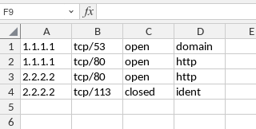

# nmapXML2XLSX
`nmap` XML (`-oX`) to `xlsx` convertor.

## Install

```bash
$ sudo ln -s `pwd`/nmapXML2XLSX.py /usr/local/bin/nmapXML2XLSX
```

## Usage

```bash
$ nmapXML2XLSX nmap.xml nmap.xlsx
```

## Expected XML format

The tool expects the following file format. If something goes wrong with parsing it is probably because of this.

```xml
<?xml version="1.0" encoding="UTF-8"?>
<!DOCTYPE nmaprun>
<?xml-stylesheet href="file:///usr/bin/../share/nmap/nmap.xsl" type="text/xsl"?>
<!-- Nmap 7.94SVN scan initiated Mon Sep 16 20:10:32 2024 as: nmap -oX default_1.nmap -iL s1.txt -Pn -->
<nmaprun scanner="nmap" args="nmap -oX default_1.nmap -iL scope.txt -Pn" start="1726503032" startstr="Mon Sep 16 20:10:32 2024" version="7.94SVN" xmloutputversion="1.05">
    <scaninfo type="syn" protocol="tcp" numservices="1000" services="1,3-4..."/>
    <verbose level="0"/>
    <debugging level="0"/>
    <host starttime="1726503034" endtime="1726503183">
        <status state="up" reason="user-set" reason_ttl="0"/>
        <address addr="1.1.1.1" addrtype="ipv4"/>
        <hostnames>
        </hostnames>
        <ports>
            <extraports state="filtered" count="921">
                <extrareasons reason="no-response" count="921" proto="tcp" ports="1,3-4..."/>
            </extraports>
            <extraports state="closed" count="68">
                <extrareasons reason="reset" count="68" proto="tcp" ports="20-21,125,783..."/>
            </extraports>
            <port protocol="tcp" portid="53">
                <state state="open" reason="syn-ack" reason_ttl="45"/>
                <service name="domain" method="table" conf="3"/>
            </port>
            <port protocol="tcp" portid="80">
                <state state="open" reason="syn-ack" reason_ttl="44"/>
                <service name="http" method="table" conf="3"/>
            </port>
        </ports>
        <times srtt="235239" rttvar="11953" to="283051"/>
    </host>
    <host starttime="1726503034" endtime="1726503183">
        <status state="up" reason="user-set" reason_ttl="0"/>
        <address addr="2.2.2.2" addrtype="ipv4"/>
        <hostnames>
        </hostnames>
        <ports>
            <extraports state="filtered" count="996">
                <extrareasons reason="no-response" count="995" proto="tcp" ports="1,3-4,..."/>
                <extrareasons reason="host-unreach" count="1" proto="tcp" ports="514"/>
            </extraports>
            <port protocol="tcp" portid="80">
                <state state="open" reason="syn-ack" reason_ttl="43"/>
                <service name="http" method="table" conf="3"/>
            </port>
            <port protocol="tcp" portid="113">
                <state state="closed" reason="reset" reason_ttl="43"/>
                <service name="ident" method="table" conf="3"/>
            </port
        </ports>
        <times srtt="324781" rttvar="21151" to="409385"/>
    </host>
    <host starttime="1726503034" endtime="1726503183">
        ...
    </host>
    ...
    <runstats>
        <finished time="1726503184" timestr="Mon Sep 16 20:13:04 2024" summary="Nmap done at Mon Sep 16 20:13:04 2024; 17 IP addresses (17 hosts up) scanned in 151.87 seconds" elapsed="151.87" exit="success"/>
        <hosts up="17" down="0" total="17"/>
    </runstats>
</nmaprun>
```

## Output XLSX structure


